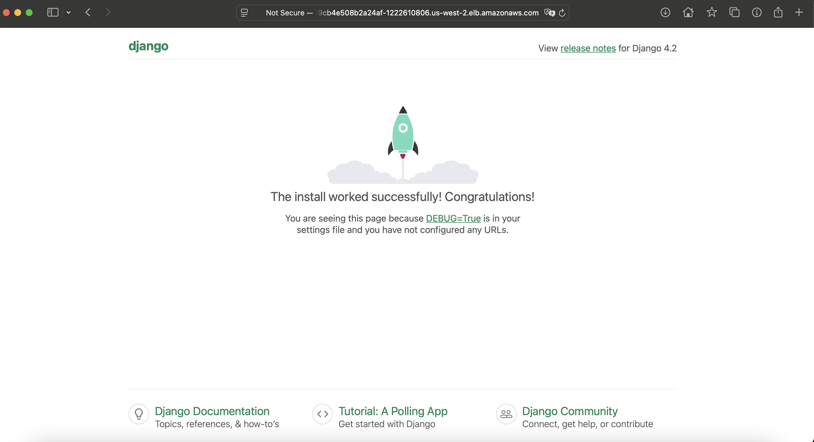

# DevOps-CI-CD

Це навчальний проєкт, у якому Django-застосунок проходить повний шлях від коду до деплою в Kubernetes.

- локальний запуск через Docker Compose
- AWS інфраструктура через Terraform
- Docker image у Amazon ECR
- EKS кластер
- Jenkins для CI
- Argo CD для GitOps
- Prometheus і Grafana для моніторингу
- автоматичний деплой застосунку в Kubernetes

## Що вийшло в результаті

- EKS кластер в AWS
- Jenkins, встановлений через Helm
- Argo CD, встановлений через Helm
- Prometheus і Grafana, встановлені через Helm
- pipeline у Jenkins, який:
  - бере код з GitHub
  - збирає Docker image
  - пушить image в ECR
  - оновлює GitOps repo
- Argo CD, який підтягує зміну з GitOps repo і деплоїть застосунок
- Django app, який працює в Kubernetes

## Структура проєкту

```text
docker/
├── django/                 # Django Dockerfile і requirements
├── nginx/                  # Nginx для локального запуску
└── docker-compose.yaml     # Локальний запуск

helm/
└── django-chart/           # Локальний Helm chart для застосунку

terraform/
├── main.tf                 # VPC + ECR + EKS + optional RDS/Aurora
├── outputs.tf
├── variables.tf
├── versions.tf
├── backend.tf
├── terraform.tfvars.example
├── cicd/                   # Окремий Terraform root для Jenkins + Argo CD
│   ├── main.tf
│   ├── outputs.tf
│   ├── variables.tf
│   ├── versions.tf
│   ├── backend.tf
│   └── terraform.tfvars.example
└── modules/
    ├── vpc/
    ├── ecr/
    ├── eks/
    ├── rds/
    ├── ci-iam/
    ├── jenkins/
    ├── argo_cd/
    └── monitoring/

Jenkinsfile                 # Jenkins pipeline
argocd/application.yaml     # Приклад Application manifest
README.md
```

## Як проходить деплой

1. Код лежить у цьому репозиторії.
2. Jenkins читає `Jenkinsfile`.
3. Jenkins збирає Docker image і пушить його в ECR.
4. Jenkins оновлює тег image у GitOps repo.
5. Argo CD бачить зміну в GitOps repo.
6. Argo CD синхронізує застосунок у кластер.

Тобто деплой тут іде не напряму з Jenkins у Kubernetes, а через GitOps.

## Важливий момент про GitOps repo

Для Argo CD використовується окремий репозиторій:

```text
https://github.com/ValeriiaSeliverstova/DevOps-CI-CD-gitops.git
```

Саме його Argo CD відстежує.

Це важливо, бо:

- у цьому repo лежить код і `Jenkinsfile`
- у GitOps repo лежить Helm chart, який реально деплоїться Argo CD

## Що потрібно перед стартом

Локально мають бути встановлені:

- `aws`
- `terraform`
- `kubectl`
- `helm`
- `docker`

Також мають бути налаштовані AWS credentials.

## AWS ресурси, які створюються

Після запуску Terraform створюються:

- VPC
- public/private subnets
- Internet Gateway
- NAT Gateway
- ECR repository `goit-ecr`
- EKS cluster `goit-eks`
- node group на `t3.small`
- optional: RDS instance або Aurora cluster
- Jenkins у namespace `jenkins`
- Argo CD у namespace `argocd`
- Prometheus і Grafana у namespace `monitoring`

## Чому Terraform розділений на 2 частини

Проєкт запускається у два етапи:

### 1. Базова інфраструктура

Папка:

```text
terraform/
```

Тут створюються:

- VPC
- ECR
- EKS
- за потреби: RDS або Aurora через модуль `rds`

### 2. CI/CD сервіси

Папка:

```text
terraform/cicd/
```

Тут встановлюються:

- Jenkins
- Argo CD
- Prometheus
- Grafana

Це зручніше, бо Jenkins, Argo CD і monitoring stack залежать від уже готового EKS.

## Підняти інфраструктуру

### Крок 1. VPC + ECR + EKS

```bash
cd terraform
terraform init -reconfigure
terraform plan
terraform apply
```

Після цього підключаємо `kubectl`:

```bash
aws eks update-kubeconfig --region us-west-2 --name goit-eks
kubectl get nodes
kubectl get pods -A
```

У нас фінально використовувався кластер на:

- `t3.small`
- `desired_size = 3`
- `min_size = 2`
- `max_size = 3`

Це важливо, бо на `t3.micro` Jenkins і Argo CD разом не влазили.

## Модуль RDS

У `terraform/modules/rds` є окремий універсальний модуль для бази даних.

Він може створювати:

- звичайний `RDS instance`
- або `Aurora cluster`

Перемикач простий:

```hcl
use_aurora = true
```

Якщо `use_aurora = false`, створюються:

- `aws_db_subnet_group`
- `aws_security_group`
- `aws_db_parameter_group`
- `aws_db_instance`

Якщо `use_aurora = true`, створюються:

- `aws_db_subnet_group`
- `aws_security_group`
- `aws_rds_cluster_parameter_group`
- `aws_rds_cluster`
- `writer`
- `reader replicas`

## Приклад підключення модуля

### Звичайний PostgreSQL RDS

```hcl
module "rds" {
  source = "./modules/rds"

  name                       = "myapp-db"
  use_aurora                 = false
  engine                     = "postgres"
  engine_version             = "14.22"
  parameter_group_family_rds = "postgres14"

  instance_class          = "db.t3.micro"
  allocated_storage       = 20
  db_name                 = "myapp"
  username                = "postgres"
  password                = "admin123AWS23"
  subnet_private_ids      = module.vpc.private_subnets
  subnet_public_ids       = module.vpc.public_subnets
  publicly_accessible     = false
  vpc_id                  = module.vpc.vpc_id
  multi_az                = false
  backup_retention_period = "7"

  parameters = {
    max_connections = "200"
  }

  tags = {
    Environment = "dev"
    Project     = "myapp"
  }
}
```

## Як змінити тип БД

Для звичайного RDS:

```hcl
use_aurora = false
engine     = "postgres"
```

або

```hcl
use_aurora = false
engine     = "mysql"
```

Для Aurora:

```hcl
use_aurora     = true
engine_cluster = "aurora-postgresql"
```

або

```hcl
use_aurora     = true
engine_cluster = "aurora-mysql"
```

### Крок 2. Jenkins + Argo CD

```bash
cd terraform/cicd
terraform init -reconfigure
terraform plan
terraform apply
```

Після цього перевірка:

```bash
kubectl get pods -n jenkins
kubectl get pods -n argocd
kubectl get pods -n monitoring
```

Очікуємо, що всі pod-и будуть у `Running`.

## Моніторинг

У `terraform/cicd` тепер також піднімається monitoring stack:

- `Prometheus`
- `Grafana`

Ставиться це окремим Terraform-модулем:

```text
terraform/modules/monitoring
```

Всередині:

- `Prometheus` ставиться Helm chart-ом `prometheus-community/prometheus`
- `Grafana` ставиться Helm chart-ом `grafana/grafana`
- Grafana одразу отримує datasource на внутрішній Prometheus service

Щоб не перевантажувати навчальний кластер, сервіси підняті як `ClusterIP`, без persistence.

## Як зайти в Prometheus

```bash
kubectl port-forward -n monitoring svc/prometheus-server 9090:80
```

Потім відкриваємо:

```text
http://localhost:9090
```

## Як зайти в Grafana

```bash
kubectl port-forward -n monitoring svc/grafana 3000:80
```

Потім відкриваємо:

```text
http://localhost:3000
```

Логін:

```text
admin
```

Пароль задається в:

```text
terraform/cicd/terraform.tfvars
```

або в прикладі:

```text
terraform/cicd/terraform.tfvars.example
```

## Як зайти в Jenkins

```bash
kubectl port-forward -n jenkins svc/jenkins 8080:8080
```

Потім відкриваємо:

```text
http://localhost:8080
```

Логін:

```text
admin
```

Пароль можна взяти так:

```bash
kubectl get secret -n jenkins jenkins -o jsonpath="{.data.jenkins-admin-password}" | base64 --decode && echo
```

## Як зайти в Argo CD

```bash
kubectl port-forward -n argocd svc/argocd-server 8081:80
```

Потім відкриваємо:

```text
http://localhost:8081
```

Логін:

```text
admin
```

Пароль:

```bash
kubectl get secret -n argocd argocd-initial-admin-secret -o jsonpath="{.data.password}" | base64 --decode && echo
```

## Як налаштувати Jenkins pipeline

У Jenkins створюється job типу `Pipeline`.

Далі:

- `Definition` -> `Pipeline script from SCM`
- `SCM` -> `Git`
- `Repository URL` -> repo з цим проєктом
- `Branch Specifier` -> потрібна гілка, наприклад `*/lesson-8-9` або `*/main`
- `Script Path` -> `Jenkinsfile`

## Які credentials потрібні в Jenkins

Для push у GitOps repo треба додати credentials:

- тип: `Username with password`
- `ID`: `gitops-repo-creds`

Важливо: ці credentials мають бути додані в `System / Global credentials`, а не тільки в user credentials.

## Що робить Jenkinsfile

Pipeline робить таке:

1. Створює Kubernetes agent pod
2. Клонує цей repo
3. Вираховує короткий commit hash
4. Збирає Docker image через Kaniko
5. Пушить image в ECR
6. Клонує GitOps repo
7. Міняє тег image у `helm/django-chart/values.yaml`
8. Комітить зміну
9. Пушить зміну в `main`

## Що було виправлено по ходу роботи

Під час налаштування довелося виправити кілька важливих речей:

- винести Jenkins і Argo CD в окремий Terraform root `terraform/cicd`
- зменшити requests/limits для Jenkins і Argo CD
- увімкнути `installLatestPlugins: true` для Jenkins, бо падали pipeline plugins
- виправити `Jenkinsfile`, щоб pipeline коректно працював
- додати GitOps credentials у правильний Jenkins credentials store
- додати `POSTGRES_PASSWORD` у GitOps chart

## Поточний робочий сценарій

1. Зміна потрапляє в repo
2. Jenkins запускає pipeline
3. Image пушиться в ECR
4. GitOps repo оновлюється
5. Argo CD синхронізує застосунок
6. У namespace `django-app` з’являються pod-и
7. Сервіс отримує `LoadBalancer`

## Перевірка, що все працює

### Jenkins

У Jenkins build має завершитися:

```text
SUCCESS
```

### Argo CD

```bash
kubectl get application django-app -n argocd
```

Очікуємо:

- `Synced`
- `Healthy`

### Pods застосунку

```bash
kubectl get pods -n django-app
kubectl get svc -n django-app
```

У нас фінально були:

- Django pods
- Postgres pod
- Nginx pod
- `LoadBalancer` service

Після першого деплою Django один раз не зміг підключитися до Postgres, бо база ще стартувала.

Через це був `502 Bad Gateway`.

Проблему вирішили рестартом Django deployment:

```bash
kubectl rollout restart deployment django-app-django -n django-app
```

Після цього Django почав відповідати `200 OK`.

## Корисні команди

### Перевірка кластера

```bash
kubectl get nodes
kubectl get pods -A
```

### Jenkins

```bash
kubectl get pods -n jenkins
kubectl logs -n jenkins jenkins-0 -c jenkins --tail=100
kubectl port-forward -n jenkins svc/jenkins 8080:8080
```

### Argo CD

```bash
kubectl get pods -n argocd
kubectl get application django-app -n argocd
kubectl port-forward -n argocd svc/argocd-server 8081:80
```

### Django app

```bash
kubectl get pods -n django-app
kubectl get svc -n django-app
kubectl logs -n django-app deployment/django-app-django --tail=100
kubectl logs -n django-app deployment/django-app-postgres --tail=100
kubectl logs -n django-app deployment/django-app-nginx --tail=100
```

### Оновити kubeconfig

```bash
aws eks update-kubeconfig --region us-west-2 --name goit-eks
```

## Як усе видалити

### CI/CD частина

```bash
cd terraform/cicd
terraform destroy
```

### Базова інфраструктура

```bash
cd terraform
terraform destroy
```

### Перевірка, що все видалилось

```bash
aws eks list-clusters --region us-west-2
aws ecr describe-repositories --region us-west-2
```

## Підсумок

CI/CD ланцюжок:

- Terraform створює AWS інфраструктуру
- Jenkins будує image і пушить його в ECR
- Jenkins оновлює GitOps repo
- Argo CD синхронізує зміни в Kubernetes
- Django застосунок працює в EKS

```text
GitHub -> Jenkins -> ECR -> GitOps repo -> Argo CD -> EKS
```


